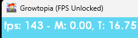

# gt-unlocked
`gt-unlocked` is a tool used to increase the framerate limit in Growtopia's Windows client. It is compatible with both the legacy and Steam/Ubiconnect clients.

## Why?
Playing Growtopia at 144 FPS and above is a much smoother and more enjoyable experience. 

## Usage
Download the latest release from the [Releases page](https://github.com/houzeyhoo/gt-unlocked/releases) and drop the appropriate `dinput8.dll` file into your Growtopia installation directory.

After installing, Growtopia's framerate limit will automatically match the refresh rate of your primary display. Note that if you're not using a monitor with a refresh rate greater than 60HZ, you will not benefit from using this tool at all.

## Warning
**Certain Growtopia mechanics are tied to the client framerate.** After extensive testing (years of use), I am yet to run into any sort of issue caused by playing at higher framerates. Regardless, this is merely a proof of concept and I cannot guarantee that you won't get banned for using this tool. Do so at your own risk.